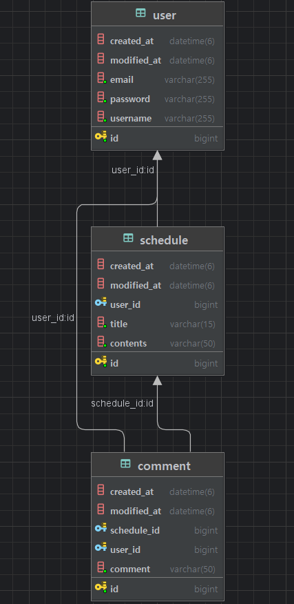

# ScheduleApp

## 👨‍🏫 프로젝트 소개
일정 관리 시스템을 설계하고, 자바의 객체 지향 설계와 함께 Spring의 유효성 검증, 예외 처리, JPA 연관관계, 페이징 기능을 활용한 프로젝트입니다.

---

## ⏲️ 개발 기간
- 2025.05.15(목) ~ 2023.05.26(수)

---

## 💻 개발환경
- **Version** : Java 17
- **Framework** : Spring Boot
- **IDE** : IntelliJ

---

## 📂 프로젝트 구조
```bash
Schedule/
├── build.gradle
├── settings.gradle
├── schedule.sql
├── README.md
├── HELP.md
├── .gitignore
├── src/
│   └── main/
│       ├── java/
│       │   └── com.example.scheduleappdevelop/
│       │       ├── comment/
│       │       │   ├── controller/
│       │       │   │   └── CommentController.java
│       │       │   ├── dto/
│       │       │   │   ├── CommentRequestDto.java
│       │       │   │   └── CommentResponseDto.java
│       │       │   ├── entity/
│       │       │   │   └── Comment.java
│       │       │   ├── repository/
│       │       │   │   └── CommentRepository.java
│       │       │   └── service/
│       │       │       └── CommentService.java
│       │       ├── common/
│       │       │   ├── Const.java
│       │       │   ├── entity/
│       │       │   │   └── BaseEntity.java
│       │       │   └── filter/
│       │       │       ├── CustomFilter.java
│       │       │       └── LoginFilter.java
│       │       ├── config/
│       │       │   ├── PasswordEncoder.java
│       │       │   └── WebConfig.java
│       │       ├── schedule/
│       │       │   ├── controller/
│       │       │   │   └── ScheduleController.java
│       │       │   ├── dto/
│       │       │   │   ├── SchedulePageInfoResponseDto.java
│       │       │   │   ├── SchedulePageRequestDto.java
│       │       │   │   ├── SchedulePageResponseDto.java
│       │       │   │   ├── ScheduleRequestDto.java
│       │       │   │   ├── ScheduleResponseDto.java
│       │       │   │   └── UpdateScheduleRequestDto.java
│       │       │   ├── entity/
│       │       │   │   └── Schedule.java
│       │       │   ├── repository/
│       │       │   │   └── ScheduleRepository.java
│       │       │   └── service/
│       │       │       └── ScheduleService.java
│       │       └── user/
│       │           ├── controller/
│       │           │   └── UserController.java
│       │           ├── dto/
│       │           │   ├── LoginRequestDto.java
│       │           │   ├── LoginResponseDto.java
│       │           │   ├── SignUpRequestDto.java
│       │           │   ├── SignUpResponseDto.java
│       │           │   ├── UpdatePasswordRequestDto.java
│       │           │   └── UserResponseDto.java
│       │           ├── entity/
│       │           │   └── User.java
│       │           ├── repository/
│       │           │   └── UserRepository.java
│       │           └── service/
│       │               └── UserService.java
│       └── resources/
│           ├── static/
│           ├── templates/
│           └── application.properties
└── test/

```

---

## ⚙️ 프로젝트 설명
### Lv0. -- 완료 --
- API 명세서 작성
- ERD 작성
- SQL 작성

### Lv1. -- 완료 --
- 일정 CRUD
   - 일정을 생성, 조회, 수정, 삭제할 수 있다.
   - 일정은 아래 필드를 가진다.
     -  `작성 유저명`, `할일 제목`, `할일 내용`, `작성일`, `수정일` 필드
     - `작성일`, `수정일` 필드는 `JPA Auditing`을 활용

### Lv2. -- 완료 --
- 유저 CRUD
  - 유저를 생성, 조회, 수정, 삭제할 수 있다.
  - 유저는 아래와 같은 필드를 가진다.
    - `유저명`, `이메일`, `작성일` , `수정일` 필드
    - `작성일`, `수정일` 필드는 `JPA Auditing`을 활용
  -  연관관계 구현
    - 일정은 이제 `작성 유저명` 필드 대신 `유저 고유 식별자` 필드를 가진다.

### Lv3. -- 완료 --
- 회원가입
  - 유저에 `비밀번호` 필드 추가

### Lv4. -- 완료 --
- 로그인(인증)
  - **설명**
    - **Cookie/Session**을 활용해 로그인 기능 구현
    -  필터를 활용해 인증 처리
    - `@Configuration` 을 활용해 필터를 등록
  -  **조건**
     - `이메일`과 `비밀번호`를 활용해 로그인 기능을 구현
     -  회원가입, 로그인 요청은 인증 처리에서 제외
  -  **예외처리**
     - 로그인 시 이메일과 비밀번호가 일치하지 않을 경우 HTTP Status code 401을 반환

### Lv5. -- 완료 --
- 다양한 예외처리 적용하기
  - `Validation`을 활용해 다양한 예외처리 적용

### Lv6. -- 완료 --
- 비밀번호 암호화
  - `비밀번호` 필드에 들어가는 비밀번호를 암호화
    - 암호화를 위한 `PasswordEncoder`를 직접 만들어 사용

### Lv7. -- 완료 --
- 댓글 CRUD
  - 생성한 일정에 댓글을 남길 수 있습니다.
    - 댓글과 일정은 연관관계를 가진다.
  - 댓글을 저장, 조회, 수정, 삭제할 수 있다.
  - 댓글은 아래와 같은 필드를 가진다.
    -  `댓글 내용`, `작성일`, `수정일`, `유저 고유 식별자`, `일정 고유 식별자` 필드
    - `작성일`, `수정일` 필드는 `JPA Auditing`을 활용하여 적용

### Lv8. -- 완료 --
- 일정 페이징 조회
  - 일정을 Spring Data JPA의 `Pageable`과 `Page` 인터페이스를 활용하여 페이지네이션을 구현
    -  `페이지 번호`와 `페이지 크기`를 쿼리 파라미터로 전달하여 요청하는 항목을 나타낸다.
    -  `할일 제목`, `할일 내용`, `댓글 개수`, `일정 작성일`, `일정 수정일`, `일정 작성 유저명` 필드를 조회
    - 디폴트 `페이지 크기`는 10으로 적용
  - 일정의 `수정일`을 기준으로 내림차순 정렬

---

## 📌 주요 기능
- 일정 생성/조회/수정/삭제 기능 구현
- 유저 생성/조회/수정/삭제 기능 구현
- 일정과 유저는 작성자 ID 기준으로 연관관계 설정
- 회원가입 시 비밀번호 필드 추가
- 로그인 시 이메일+비밀번호 사용, 쿠키/세션 기반 인증 구현
- 필터와 @Configuration으로 인증 처리
- Validation으로 입력값 예외처리 적용
- 비밀번호는 PasswordEncoder로 직접 암호화
- 일정에 댓글 작성 가능, 댓글 CRUD 구현 (일정·유저와 연관관계)
- 일정 조회 시 페이지 번호/크기 쿼리로 페이징 처리 (기본 10개씩)

---

## 📌 API 명세
자세한 API 명세는 아래 노션 링크에서 확인할 수 있습니다.  
🔗 [API 명세서 바로가기](https://www.notion.so/1ff25128a64980dab5aac0bdcb5a9758?v=1ff25128a64980f2a7fe000cce46c938&pvs=4)

---

## 📌 ERD


---

## 📚 TIL
이 프로젝트를 진행하면서 배운 내용을 아래 벨로그에 정리하였습니다.
- [Lv0 ~ Lv4 TIL 링크](https://velog.io/@syumz/%EC%9D%BC%EC%A0%95-%EA%B4%80%EB%A6%AC-%EC%95%B1-Develop)
- [Lv5 TIL 링크](https://velog.io/@syumz/%EC%9D%BC%EC%A0%95-%EA%B4%80%EB%A6%AC-%EC%95%B1-Develop-Lv5)
- [Lv6 TIL 링크](https://velog.io/@syumz/%EC%9D%BC%EC%A0%95-%EA%B4%80%EB%A6%AC-%EC%95%B1-Develop-Lv6)
- [Lv7 TIL 링크](https://velog.io/@syumz/%EC%9D%BC%EC%A0%95-%EA%B4%80%EB%A6%AC-%EC%95%B1-Develop-Lv7)
- [Lv8 TIL 링크](https://velog.io/@syumz/%EC%9D%BC%EC%A0%95-%EA%B4%80%EB%A6%AC-%EC%95%B1-Develop-Lv8)

